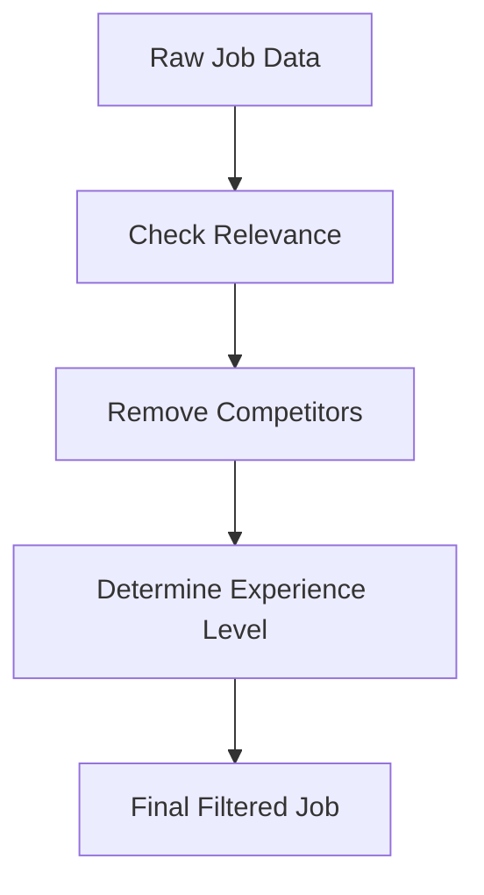

# GenAI-Job-Scrapper
Job Scrapper

# GenAI-Job-Scrapper for Naukri.com

A domain-specific job scraper for [Naukri.com](https://www.naukri.com/) that extracts job listings, filters them using AI analysis, and exports results to Excel files.


## Features
- 🎯 **Domain-Specific Scraping**  
  Select from 11+ predefined domains (Data Science, HR, Cyber Security, etc.)
- 🧠 **AI-Powered Filtering**  
  - Job relevance detection  
  - Competitor filtering  
  - Experience level classification  
- 📊 **Clean Excel Export**  
  Download filtered results for **one domain at a time** (no SQLite DB)
- 🔁 **Duplicate Detection**  
  Prevents duplicate job listings using content-based hashing
- 🕵️ **Headless Scraping**  
  Uses Selenium + BeautifulSoup for reliable job extraction

## Requirements
```bash
pip install -r requirements.txt
```

**You'll need:**
- Groq API key (for LLM processing)
- Tavily API key (for company research)
- Chrome browser installed

## Usage
1. Replace API keys in `app.py`:
```python
groq_api_key = "your-groq-key"
tavily_api_key = "your-tavily-key"
```

2. Run the Streamlit app:
```bash
streamlit run app.py
```

3. In the web interface:
   - Select a job domain from the dropdown
   - Click **"Scrape Jobs"**
   - Wait 1-2 minutes for results
   - Download Excel file with filtered jobs

## Code Structure
```bash
├── app.py            # Main Streamlit application
├── requirements.txt  # Python dependencies
├── screenshot.png    # UI preview image
```

## How It Works
1. **Scraping**  
   - Uses Selenium to scrape Naukri.com
   - Extracts job details with BeautifulSoup

2. **AI Filtering**  
   - Processes jobs through a LangGraph workflow:
     - Filters relevant jobs using LLM
     - Removes competitor postings
     - Classifies job tiers (Fresher/Mid/Senior)

3. **Export**  
   - Exports clean results to Excel (in-memory)
   - Only allows downloading for the selected domain

4. **Anti-Duplication**  
   - Uses MD5 hashes of job title/company/description
   - Prevents duplicate entries in results

## Key Components
### 🧠 AI Workflow



### 🔍 Duplicate Detection
```python
def get_job_hash(job: dict) -> str:
    unique_string = f"{job['Title']}|{job['Company']}|{job['Description']}"
    return hashlib.md5(unique_string.encode()).hexdigest()
```

## Requirements.txt
```txt
streamlit==1.24.0
selenium==4.19.0
beautifulsoup4==4.12.3
groq==0.5.10
langgraph==0.0.35
tavily==1.0.0
pandas==2.2.2
xlsxwriter==3.0.9
fake-useragent==1.4.1
selenium-stealth==1.0.4
```


